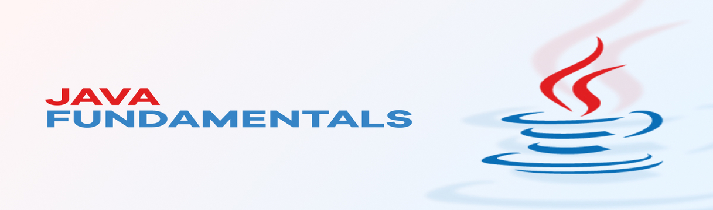

 **[](https://tekwill.md/tekwill-academy/)**


##📌Description 

#### According to Oracle, Java is one of the most widely used programming languages ​​globally and runs on 3 billion mobile phones, 1 billion computers and 45 billion virtual machines. These numbers are the result of just 8 million Java developers globally innovating around the world every day.

_________________________________________________________________________________________________


#### Java Fundamentals is a 90-hour training course from scratch. It is guided by a mentor and is intended for all those who do not have programming knowledge.
_________________________________________________________________________________________________

##📌Exercises
>
>- **🔥[Lesson Teacher Version](https://github.com/UmanetAlexandru/Tekwill2022)**
>
>- **🔥[Lesson 1](Lesson_1)**
>
>- **🔥[Lesson 2](Lesson_2)**
>
>- **🔥[Lesson 3](Lesson_3)**
> 
>- **🔥[Lesson 4](Lesson_4)**
>
>- **🔥[Lesson 5](Lesson_5)**
>

##📌Installation

````
$ git clone https://github.com/serbug/Tekwill.git
$ git checkout -b some-branch
````

